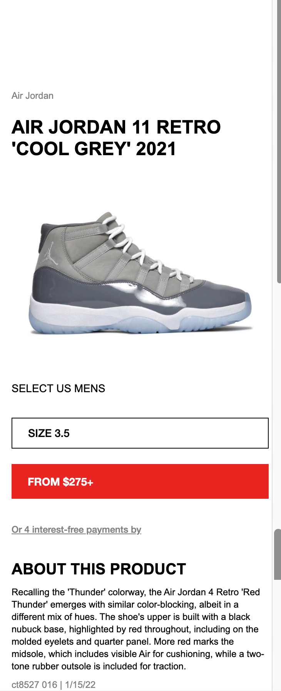

# Procesverslag
Markdown is een simpele manier om HTML te schrijven.  
Markdown cheat cheet: [Hulp bij het schrijven van Markdown](https://github.com/adam-p/markdown-here/wiki/Markdown-Cheatsheet).

Nb. De standaardstructuur en de spartaanse opmaak van de README.md zijn helemaal prima. Het gaat om de inhoud van je procesverslag. Besteedt de tijd voor pracht en praal aan je website.

Nb. Door *open* toe te voegen aan een *details* element kun je deze standaard open zetten. Fijn om dat steeds voor de relevante stuk(ken) te doen.

## Jij

uitwerken voor kick-off werkgroep

### Auteur:
Darryn Leysner

#### Je startniveau:
Blauw

#### Je focus:
Surface plane
 

## Je website

uitwerken voor kick-off werkgroep

### Je opdracht:
https://www.flightclub.com

#### Screenshot(s) van de eerste pagina (small screen): 
Homescherm

#### Screenshot(s) van de tweede pagina (small screen):
Sneakers 

 

## Breakdownschets (week 1)

uitwerken na afloop 2e werkgroep

### de hele pagina: 

### dynamisch deel (bijv menu): 

### wellicht nog een dynamisch deel (bijv filter): 

## Voortgang 1 (week 2)

In week 2 ben ik vooral aan de slag gegaan met het leren van CSS positioneren. De "position" property wordt gebruikt om de positie voor een element in te stellen. Met de property position: fixed, heb ik ervoor kunnen zorgen dat de navigatiebalk van mijn pagina op een vaste plek blijft staan als de gebruiker scrollt.

### Stand van zaken
Wat ik vooral lastig vond is om onderscheid te maken tussen de verschillende positions. Zo vond ik bijv. sticky en fixed position erg veel op elkaar lijken en wist ik niet precies welke position ik wanneer moest gebruiken. Uitendelijk door een beetje te spelen met de positions en met hulp van de studentenassistent is dit mij toch gelukt.

## Voortgang 2 (week 3)

In deze week ben ik verder gegaan met de homepagina. Ik heb samen met hulp van een studentassistent ervoor kunnen zorgen dat d.m.v JavaScript de navigatiebalk van kleur veranderd als de gebruiker scrollt door de pagina heen. Dit was nodig omdat de navigatiebalk op sommige delen van de pagina niet zichtbaar door hetzelfde kleurgebruik.
Verder ben ik begonnen aan het producten gedeelte van de pagina.

### Stand van zaken
Het producten gedeelte vond ik erg lastig om te maken. Ik moest namelijk 4 boxen met producten die hebben: 2 naast elkaar en 2 onder elkaar. Ik heb dit geprobeerd d.m.v flexbox alleen kreeg ik de boxen niet nejes uitgelijnd. Uiteindelijk was dit wel gelukt met behulp van de docent.

## Toegankelijkheidstest (week 4)

In deze werkgroep hebben we toegankelijkheidstesten uitgevoerd.De eerste test was met een bril die mijn zicht beperkte. Hiermee kon ik zien of mijn website wel goed leesbaar was voor slechtzienden. De tweede test was met een apparaat die op mijn arm geplaatst moest worden en hiervan ging mijn arm erg trillen.

### Bevindingen
Lijst met je bevindingen die in de test naar voren kwamen:

### Kleurgebruik
Op sommige plekken was de tekst niet goed leesbaar door onjuiste kleurgebruik. 

Dit werd opgelost door simpelweg de kleur van de tekst te veranderen.

## Voortgang 3 (week 4)

Deze week ging ik verder met de tweede pagina van mijn website. Deze was minder moeilijk dan de eerste pagina omdat ik bepaalde code van de eerste pagina kon hergebruiken voor deze pagina.

### Stand van zaken
Wat niet lukte voor mij was het maken van het menu. Ik heb vooral op YouTube gekeken hoe ik dit kon oplossen alleen kwam ik hier niet uit.   

## Eindgesprek (week 5)

Het eindgesprek 

### Stand van zaken
Wat goed ging is dat ik voldeed aan de minimale eisen van de beoordelingscriteria. Ik had een microinteractie, ik maakte gebruik van variabelen en de code was netjes opgezet. Wat minder goed ging is dat ik niet heel veel content had gemaakt en het menu was niet klikbaar. Al met al heb ik het toch nog nog een voldoende kunnen scoren mededankzij mijn docent. Ookal hou ik totaal niet van coderen heeft hij er toch voor kunnen zorgen dat de lessen niet alleen informatief maar ook erg leuk waren. Thanks Robert!

### Screenshot(s)

## Bronnenlijst

continu bijhouden terwijl je werkt

Nb. Wees specifiek ('css-tricks' als bron is bijv. niet specifiek genoeg).

1. YouTube.com
2. w3schools.com
3. pxtoem.com
4. DLO oefeningen
5. Docent en studentassisten

